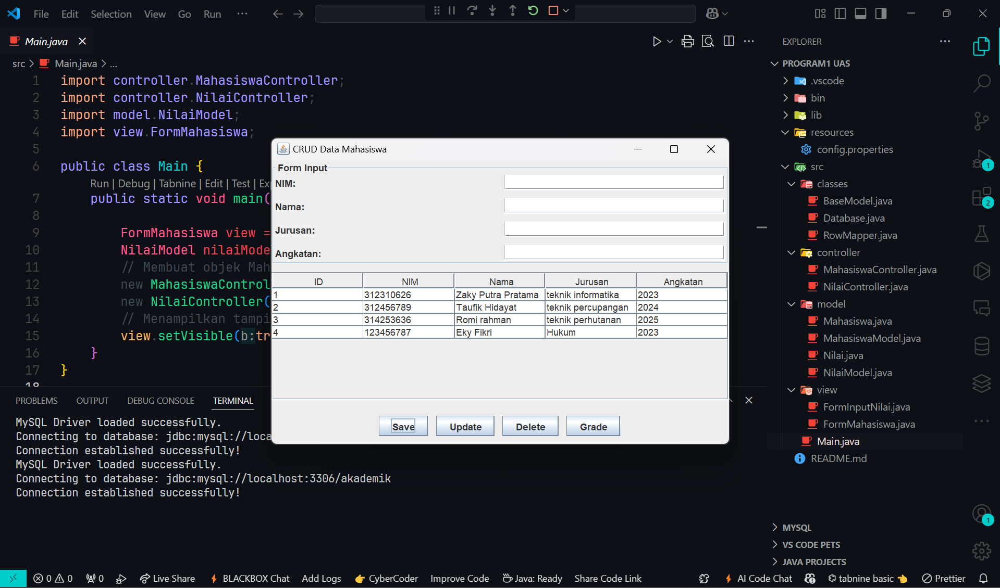
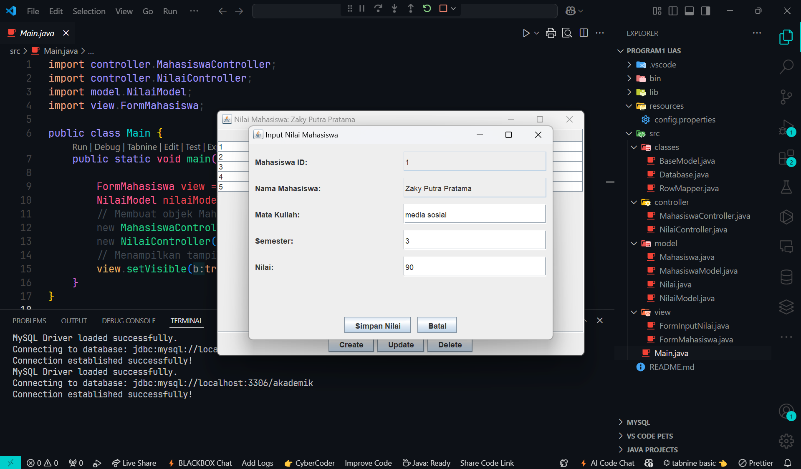
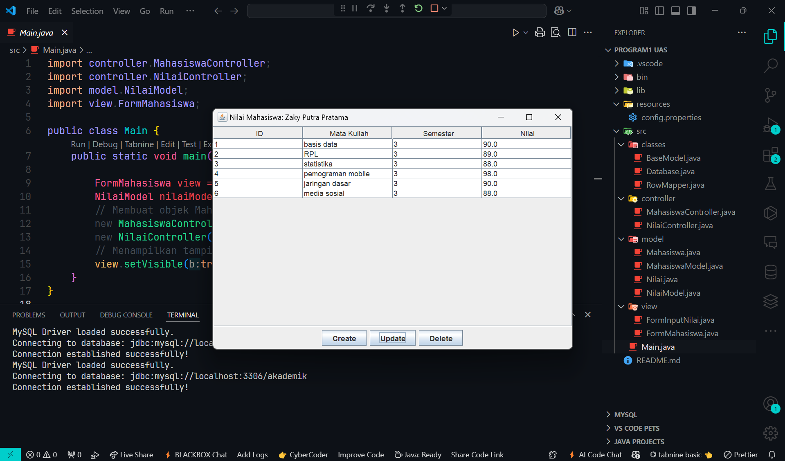

# UAS-OOP
CRUD MAHASISWA <br>
MVC (Model-View-Controller)
| Keterangan | Data                |
| ---------- | ------------------- |
| **Nama**   | Zaky Putra Pratama |
| **NIM**    | 312310613           |
| **Kelas**  | TI.23.A6            |
| **MatKul**  | OOP               |
| **Dosen**  | Agung Nugroho, S.Kom., M.Kom.            |
# Output
## Form mahasiswa

## Form Nilai

### Create Nilai


### Update Nilai


### Delete Nilai


# Code Program
## Create Databases
```mysql
mysql -u root

create database akademik;

use akademik;

CREATE TABLE mahasiswa (
  id INT(11) NOT NULL AUTO_INCREMENT PRIMARY KEY,
  nama VARCHAR(100) DEFAULT NULL,
  nim VARCHAR(50) DEFAULT NULL,
  jurusan VARCHAR(100) DEFAULT NULL,
  angkatan INT(11) DEFAULT NULL
);

CREATE TABLE nilai (
  id INT(11) NOT NULL AUTO_INCREMENT PRIMARY KEY,
  mahasiswa_id INT(11) NOT NULL,
  mata_kuliah VARCHAR(100) NOT NULL,
  semester INT(11) NOT NULL,
  nilai DOUBLE NOT NULL,
  KEY mahasiswa_id (mahasiswa_id),
  FOREIGN KEY (mahasiswa_id) REFERENCES mahasiswa (id)
);
```
# Classes
### BaseModel
```java
package classes;

import java.sql.*;
import java.util.List;
import java.util.stream.Collectors;

public abstract class BaseModel<T> {
    protected final Database database;
    protected final String tableName;
    protected final List<String> fields;

    public BaseModel(String tableName, List<String> fields) {
        this.database = new Database();
        this.tableName = tableName;
        this.fields = fields;
    }

    public T find(int id) {
        String query = "SELECT * FROM " + tableName + " WHERE id = ?";
        List<T> results = database.read(query, this::mapRow, id);
        return results.isEmpty() ? null : results.get(0);
    }

    public List<T> find() {
        String query = "SELECT * FROM " + tableName;
        return database.read(query, this::mapRow);
    }

    public boolean save(T object) {
        if (isNewRecord(object)) {
            return insert(object);
        } else {
            return update(object);
        }
    }

    protected boolean insert(T object) {
        List<String> fieldsWithoutId = fields.stream()
                .filter(field -> !field.equalsIgnoreCase("id"))
                .collect(Collectors.toList());

        String fieldNames = String.join(", ", fieldsWithoutId);
        String placeholders = String.join(", ", fieldsWithoutId.stream().map(f -> "?").toArray(String[]::new));
        String query = "INSERT INTO " + tableName + " (" + fieldNames + ") VALUES (" + placeholders + ")";
        return database.executeUpdate(query, getValues(object, false)) > 0;
    }

    protected boolean update(T object) {
        List<String> fieldsWithoutId = fields.stream()
                .filter(field -> !field.equalsIgnoreCase("id"))
                .collect(Collectors.toList());

        String setClause = String.join(", ", fieldsWithoutId.stream().map(f -> f + " = ?").toArray(String[]::new));
        String query = "UPDATE " + tableName + " SET " + setClause + " WHERE id = ?";
        return database.executeUpdate(query, getValues(object, true)) > 0;
    }

    public boolean delete(int id) {
        String query = "DELETE FROM " + tableName + " WHERE id = ?";
        return database.executeUpdate(query, id) > 0;
    }

    protected abstract boolean isNewRecord(T object);

    protected abstract T mapRow(ResultSet rs) throws SQLException;

    protected abstract Object[] getValues(T object, boolean includeId);

    public void close() {
        database.close();
    }
}
```
### Databases
```java
package classes;

import java.io.FileInputStream;
import java.io.IOException;
import java.sql.*;
import java.util.ArrayList;
import java.util.List;
import java.util.Properties;

public class Database {
    private Connection conn;

    public Database() {
        try {
            // Memuat driver MySQL
            Class.forName("com.mysql.cj.jdbc.Driver");
            System.out.println("MySQL Driver loaded successfully.");

            // Membaca file konfigurasi
            Properties properties = new Properties();
            properties.load(new FileInputStream("resources/config.properties"));

            // Ambil parameter koneksi
            String url = properties.getProperty("db.url");
            String user = properties.getProperty("db.user");
            String password = properties.getProperty("db.password", ""); // Gunakan string kosong jika password tidak ada

            System.out.println("Connecting to database: " + url);

            // Membuka koneksi
            conn = DriverManager.getConnection(url, user, password);
            System.out.println("Connection established successfully!");

        } catch (ClassNotFoundException e) {
            System.err.println("MySQL Driver not found!");
            e.printStackTrace();
            throw new RuntimeException("Driver MySQL tidak ditemukan.", e);
        } catch (SQLException e) {
            System.err.println("Failed to connect to the database.");
            e.printStackTrace();
            throw new RuntimeException("Gagal terhubung ke database.", e);
        } catch (IOException e) {
            System.err.println("Configuration file not found or invalid.");
            e.printStackTrace();
            throw new RuntimeException("File konfigurasi tidak ditemukan atau tidak valid.", e);
        }
    }

    public Connection getConn() {
        return conn;
    }

    /**
     * Execute Query SELECT
     */
    public ResultSet query(String query, Object... params) {
        try {
            PreparedStatement stmt = conn.prepareStatement(query);
            setParameters(stmt, params);
            return stmt.executeQuery();
        } catch (SQLException e) {
            e.printStackTrace();
            return null;
        }
    }

    /**
     * Execute an update query (INSERT, UPDATE, DELETE)
     */
    public int executeUpdate(String query, Object... params) {
        try {
            PreparedStatement stmt = conn.prepareStatement(query);
            setParameters(stmt, params);
            return stmt.executeUpdate();
        } catch (SQLException e) {
            e.printStackTrace();
            return 0;
        }
    }

    /**
     * General method to read data into a list
     *
     * @param <T>       The type of object to be returned
     * @param sql       The SELECT query
     * @param rowMapper A functional interface to map a ResultSet row into an object
     * @param params    The query parameters
     * @return A list of mapped objects
     */
    public <T> List<T> read(String sql, RowMapper<T> rowMapper, Object... params) {
        List<T> result = new ArrayList<>();
        try (ResultSet rs = query(sql, params)) {
            while (rs != null && rs.next()) {
                result.add(rowMapper.mapRow(rs));
            }
        } catch (SQLException e) {
            e.printStackTrace();
        }
        return result;
    }

    private void setParameters(PreparedStatement stmt, Object[] params) throws SQLException {
        for (int i = 0; i < params.length; i++) {
            stmt.setObject(i + 1, params[i]);
        }
    }

    public void close() {
        try {
            if (conn != null && !conn.isClosed()) {
                conn.close();
            }
        } catch (SQLException e) {
            e.printStackTrace();
        }
    }
}
```
### RowMapper
```java
package classes; 
 
import java.sql.ResultSet; 
import java.sql.SQLException; 
 
public interface RowMapper<T> { 
    T mapRow(ResultSet rs) throws SQLException; 
} 
```
## Controller
### MahasiswaController
```java
package controller;

import model.Mahasiswa;
import model.MahasiswaModel;
import model.NilaiModel;
import view.FormInputNilai;
import view.FormMahasiswa;

import javax.swing.*;
import javax.swing.table.DefaultTableModel;
import java.util.List;

public class MahasiswaController {
    private MahasiswaModel mahasiswaModel;
    private NilaiModel nilaiModel;  // Tambahkan objek NilaiModel
    private FormMahasiswa view;

    public MahasiswaController(FormMahasiswa view, NilaiModel nilaiModel) {  // Tambahkan NilaiModel ke konstruktor
        this.view = view;
        this.nilaiModel = nilaiModel;  // Inisialisasi NilaiModel
        view.btnSave.addActionListener(e -> saveData());
        view.btnUpdate.addActionListener(e -> updateData());
        view.btnDelete.addActionListener(e -> deleteData());
        view.btnViewNilai.addActionListener(e -> openFormInputNilai());  // Panggil untuk membuka form input nilai
        mahasiswaModel = new MahasiswaModel();
        loadData();
    }

    private void deleteData() {
        int selectedRow = view.tblMahasiswa.getSelectedRow();
        if (selectedRow != -1) {
            int id = Integer.parseInt(view.tblMahasiswa.getModel().getValueAt(selectedRow, 0).toString());
            if (mahasiswaModel.delete(id)) {
                JOptionPane.showMessageDialog(null, "Data berhasil dihapus!");
                loadData();
                clearForm();
            } else {
                JOptionPane.showMessageDialog(null, "Gagal menghapus data!");
            }
        } else {
            JOptionPane.showMessageDialog(null, "Pilih data yang akan dihapus!");
        }
    }

    private void updateData() {
        int selectedRow = view.tblMahasiswa.getSelectedRow();
        if (selectedRow != -1) {
            int id = Integer.parseInt(view.tblMahasiswa.getModel().getValueAt(selectedRow, 0).toString());
            Mahasiswa mhs = mahasiswaModel.find(id);
            view.txtNim.setText(mhs.getNim());
            view.txtNama.setText(mhs.getNama());
            view.txtJurusan.setText(mhs.getJurusan());
            view.txtAngkatan.setText(String.valueOf(mhs.getAngkatan()));
        } else {
            JOptionPane.showMessageDialog(null, "Pilih data yang akan diubah!");
        }
    }

    private void saveData() {
        String nim = view.txtNim.getText();
        String nama = view.txtNama.getText();
        String jurusan = view.txtJurusan.getText();
        int angkatan = Integer.parseInt(view.txtAngkatan.getText());

        Mahasiswa mhs = new Mahasiswa();
        mhs.setNim(nim);
        mhs.setNama(nama);
        mhs.setJurusan(jurusan);
        mhs.setAngkatan(angkatan);

        int selectedRow = view.tblMahasiswa.getSelectedRow();
        if (selectedRow != -1) {
            mhs.setId(Integer.parseInt(view.tblMahasiswa.getModel().getValueAt(selectedRow, 0).toString()));
        }

        if (mahasiswaModel.save(mhs)) {
            loadData();
            clearForm();
            JOptionPane.showMessageDialog(view, "Data berhasil disimpan");
        } else {
            JOptionPane.showMessageDialog(view, "Gagal menyimpan data");
        }
    }

    private void clearForm() {
        view.txtNim.setText("");
        view.txtNama.setText("");
        view.txtJurusan.setText("");
        view.txtAngkatan.setText("");
        view.tblMahasiswa.clearSelection();
    }

    private void loadData() {
        DefaultTableModel tableModel = (DefaultTableModel) view.tblMahasiswa.getModel();
        tableModel.setRowCount(0);
        view.tblMahasiswa.setModel(tableModel);
        List<Mahasiswa> mahasiswaList = mahasiswaModel.find();
        for (Mahasiswa mahasiswa : mahasiswaList) {
            tableModel.addRow(new Object[]{
                    mahasiswa.getId(),
                    mahasiswa.getNim(),
                    mahasiswa.getNama(),
                    mahasiswa.getJurusan(),
                    mahasiswa.getAngkatan()
            });
        }
    }

    private void openFormInputNilai() {
        // Pastikan form input nilai hanya terbuka saat tombol Grade ditekan
        FormInputNilai formInputNilai = new FormInputNilai(nilaiModel);
        formInputNilai.setVisible(true);
    }
}
```
### NilaiController
```java
package controller;

import model.Nilai;
import model.NilaiModel;
import view.FormInputNilai;
import view.FormMahasiswa;

import javax.swing.*;
import javax.swing.table.DefaultTableModel;
import java.awt.*;
import java.util.List;

public class NilaiController {
    private final NilaiModel nilaiModel;
    private final FormMahasiswa view;

    public NilaiController(FormMahasiswa view) {
        this.view = view;
        this.nilaiModel = new NilaiModel();

        // Tombol Grade untuk menampilkan form nilai
        view.btnViewNilai.addActionListener(e -> showNilai());
    }

    private void showNilai() {
        int selectedRow = view.tblMahasiswa.getSelectedRow();
        if (selectedRow != -1) {
            int mahasiswaId = Integer.parseInt(view.tblMahasiswa.getModel().getValueAt(selectedRow, 0).toString());
            String namaMahasiswa = view.tblMahasiswa.getModel().getValueAt(selectedRow, 2).toString();

            JFrame nilaiFrame = new JFrame("Nilai Mahasiswa: " + namaMahasiswa);
            nilaiFrame.setSize(600, 400);
            nilaiFrame.setLocationRelativeTo(view);

            DefaultTableModel tableModel = new DefaultTableModel(new String[]{"ID", "Mata Kuliah", "Semester", "Nilai"}, 0);
            JTable nilaiTable = new JTable(tableModel);
            JScrollPane scrollPane = new JScrollPane(nilaiTable);

            JPanel buttonPanel = new JPanel();
            JButton btnTambah = new JButton("Create");
            JButton btnEdit = new JButton("Update");
            JButton btnHapus = new JButton("Delete");

            // Memuat data ke tabel
            List<Nilai> nilaiList = nilaiModel.findByMahasiswaId(mahasiswaId);
            for (Nilai nilai : nilaiList) {
                tableModel.addRow(new Object[]{nilai.getId(), nilai.getMataKuliah(), nilai.getSemester(), nilai.getNilai()});
            }

            // Logika tombol Create
            btnTambah.addActionListener(e -> {
                FormInputNilai formInputNilai = new FormInputNilai(nilaiModel);
                formInputNilai.setMahasiswaId(String.valueOf(mahasiswaId));
                formInputNilai.setMahasiswaNama(namaMahasiswa);
                formInputNilai.setVisible(true);

                formInputNilai.addWindowListener(new java.awt.event.WindowAdapter() {
                    @Override
                    public void windowClosed(java.awt.event.WindowEvent windowEvent) {
                        reloadTableData(tableModel, mahasiswaId);
                    }
                });
            });

            // Logika tombol Update
            btnEdit.addActionListener(e -> {
                int selectedRowInTable = nilaiTable.getSelectedRow();
                if (selectedRowInTable != -1) {
                    int nilaiId = Integer.parseInt(nilaiTable.getValueAt(selectedRowInTable, 0).toString());
                    String mataKuliah = nilaiTable.getValueAt(selectedRowInTable, 1).toString();
                    int semester = Integer.parseInt(nilaiTable.getValueAt(selectedRowInTable, 2).toString());
                    double nilai = Double.parseDouble(nilaiTable.getValueAt(selectedRowInTable, 3).toString());

                    FormInputNilai formInputNilai = new FormInputNilai(nilaiModel);
                    formInputNilai.setMahasiswaId(String.valueOf(mahasiswaId));
                    formInputNilai.setMahasiswaNama(namaMahasiswa);
                    formInputNilai.setIdNilai(nilaiId); // Set ID untuk update
                    formInputNilai.setMataKuliah(mataKuliah);
                    formInputNilai.setSemester(String.valueOf(semester));
                    formInputNilai.setNilai(String.valueOf(nilai));
                    formInputNilai.setVisible(true);

                    formInputNilai.addWindowListener(new java.awt.event.WindowAdapter() {
                        @Override
                        public void windowClosed(java.awt.event.WindowEvent windowEvent) {
                            reloadTableData(tableModel, mahasiswaId);
                        }
                    });
                } else {
                    JOptionPane.showMessageDialog(nilaiFrame, "Pilih nilai yang akan diedit!");
                }
            });

            // Logika tombol Delete
            btnHapus.addActionListener(e -> {
                int selectedRowInTable = nilaiTable.getSelectedRow();
                if (selectedRowInTable != -1) {
                    int nilaiId = Integer.parseInt(nilaiTable.getValueAt(selectedRowInTable, 0).toString());
                    int confirm = JOptionPane.showConfirmDialog(nilaiFrame, "Yakin ingin menghapus nilai ini?");
                    if (confirm == JOptionPane.YES_OPTION) {
                        if (nilaiModel.deleteNilai(nilaiId)) {
                            tableModel.removeRow(selectedRowInTable);
                            JOptionPane.showMessageDialog(nilaiFrame, "Nilai berhasil dihapus!");
                        } else {
                            JOptionPane.showMessageDialog(nilaiFrame, "Gagal menghapus nilai!");
                        }
                    }
                } else {
                    JOptionPane.showMessageDialog(nilaiFrame, "Pilih nilai yang akan dihapus!");
                }
            });

            nilaiFrame.setLayout(new BorderLayout());
            nilaiFrame.add(scrollPane, BorderLayout.CENTER);
            buttonPanel.add(btnTambah);
            buttonPanel.add(btnEdit);
            buttonPanel.add(btnHapus);
            nilaiFrame.add(buttonPanel, BorderLayout.SOUTH);
            nilaiFrame.setVisible(true);
        } else {
            JOptionPane.showMessageDialog(view, "Pilih mahasiswa terlebih dahulu!");
        }
    }

    private void reloadTableData(DefaultTableModel tableModel, int mahasiswaId) {
        tableModel.setRowCount(0);
        List<Nilai> nilaiList = nilaiModel.findByMahasiswaId(mahasiswaId);
        for (Nilai nilai : nilaiList) {
            tableModel.addRow(new Object[]{nilai.getId(), nilai.getMataKuliah(), nilai.getSemester(), nilai.getNilai()});
        }
    }
}
```
# Model
### Mahasiswa
```java
package model; 
 
public class Mahasiswa { 
    private int id; 
    private String nim; 
    private String nama; 
    private String jurusan; 
    private int angkatan; 
 
    public Mahasiswa() { 
        super(); 
    } 
 
    public Mahasiswa(int id, String nim, String nama, String jurusan, int 
angkatan) { 
        this.id = id; 
        this.nim = nim; 
        this.nama = nama; 
        this.jurusan = jurusan; 
        this.angkatan = angkatan; 
    } 
 
    // getter and setter 
 
    public int getId() { 
        return id; 
    } 
 
    public void setId(int id) { 
        this.id = id; 
    } 
 
    public String getNim() { 
        return nim; 
    } 
 
    public void setNim(String nim) { 
        this.nim = nim; 
    } 
 
    public String getNama() { 
        return nama; 
    } 
 
    public void setNama(String nama) { 
        this.nama = nama; 
    } 
 
    public String getJurusan() { 
        return jurusan; 
    } 
 
    public void setJurusan(String jurusan) { 
        this.jurusan = jurusan; 
    } 
 
    public int getAngkatan() { 
        return angkatan; 
    } 
 
    public void setAngkatan(int angkatan) { 
        this.angkatan = angkatan; 
    } 
}
```
### MahasiswaModel
```java
package model; 
 
import classes.BaseModel; 
import java.sql.ResultSet; 
import java.sql.SQLException; 
import java.util.Arrays; 
 
public class MahasiswaModel extends BaseModel<Mahasiswa> { 
    public MahasiswaModel() { 
        super("mahasiswa", Arrays.asList("id", "nim", "nama", "jurusan", "angkatan")); 
    } 
 
    @Override 
    protected boolean isNewRecord(Mahasiswa mahasiswa) { 
        return mahasiswa.getId() == 0; 
    } 
 
    @Override 
    protected Mahasiswa mapRow(ResultSet rs) throws SQLException { 
        return new Mahasiswa( 
                rs.getInt("id"), 
                rs.getString("nim"), 
                rs.getString("nama"), 
                rs.getString("jurusan"), 
                rs.getInt("angkatan") 
        ); 
    } 
 
    @Override 
    protected Object[] getValues(Mahasiswa mahasiswa, boolean includeId) { 
        if (includeId) { 
            return new Object[]{mahasiswa.getNim(), mahasiswa.getNama(), 
mahasiswa.getJurusan(), mahasiswa.getAngkatan(), mahasiswa.getId()}; 
        } else { 
            return new Object[]{mahasiswa.getNim(), mahasiswa.getNama(), 
mahasiswa.getJurusan(), mahasiswa.getAngkatan()}; 
        } 
    } 
}
```
### Nilai
```java
package model;

public class Nilai {
    private int id;
    private int mahasiswaId;
    private String mataKuliah;
    private int semester;
    private double nilai;

    // Konstruktor dengan parameter
    public Nilai(int id, int mahasiswaId, String mataKuliah, int semester, double nilai) {
        this.id = id;
        this.mahasiswaId = mahasiswaId;
        this.mataKuliah = mataKuliah;
        this.semester = semester;
        this.nilai = nilai;
    }

    // Konstruktor tanpa parameter (default constructor)
    public Nilai() {}

    // Getter dan Setter
    public int getId() {
        return id;
    }

    public void setId(int id) {
        this.id = id;
    }

    public int getMahasiswaId() {
        return mahasiswaId;
    }

    public void setMahasiswaId(int mahasiswaId) {
        this.mahasiswaId = mahasiswaId;
    }

    public String getMataKuliah() {
        return mataKuliah;
    }

    public void setMataKuliah(String mataKuliah) {
        this.mataKuliah = mataKuliah;
    }

    public int getSemester() {
        return semester;
    }

    public void setSemester(int semester) {
        this.semester = semester;
    }

    public double getNilai() {
        return nilai;
    }

    public void setNilai(double nilai) {
        this.nilai = nilai;
    }
}
```
### NilaiModel
```java
package model;

import java.sql.*;
import java.util.ArrayList;
import java.util.List;
import classes.Database;  // Pastikan mengimpor kelas Database

public class NilaiModel {
    private Connection connection;

    // Konstruktor untuk menggunakan koneksi dari kelas Database
    public NilaiModel() {
        Database db = new Database(); // Membuat objek Database untuk mendapatkan koneksi
        this.connection = db.getConn(); // Mendapatkan koneksi dari Database
    }

    public List<Nilai> findByMahasiswaId(int mahasiswaId) {
        List<Nilai> nilaiList = new ArrayList<>();
        String query = "SELECT * FROM nilai WHERE mahasiswa_id = ?";
        try (PreparedStatement statement = connection.prepareStatement(query)) {
            statement.setInt(1, mahasiswaId);
            try (ResultSet resultSet = statement.executeQuery()) {
                while (resultSet.next()) {
                    Nilai nilai = new Nilai(
                        resultSet.getInt("id"),
                        resultSet.getInt("mahasiswa_id"),
                        resultSet.getString("mata_kuliah"),
                        resultSet.getInt("semester"),
                        resultSet.getDouble("nilai")
                    );
                    nilaiList.add(nilai);
                }
            }
        } catch (SQLException e) {
            e.printStackTrace();
        }
        return nilaiList;
    }

    public boolean createNilai(Nilai nilai) {
        String query = "INSERT INTO nilai (mahasiswa_id, mata_kuliah, semester, nilai) VALUES (?, ?, ?, ?)";
        try (PreparedStatement statement = connection.prepareStatement(query)) {
            statement.setInt(1, nilai.getMahasiswaId());
            statement.setString(2, nilai.getMataKuliah());
            statement.setInt(3, nilai.getSemester());
            statement.setDouble(4, nilai.getNilai());
            return statement.executeUpdate() > 0;
        } catch (SQLException e) {
            e.printStackTrace();
        }
        return false;
    }

    public boolean updateNilai(Nilai nilai) {
        String query = "UPDATE nilai SET mata_kuliah = ?, semester = ?, nilai = ? WHERE id = ?";
        try (PreparedStatement statement = connection.prepareStatement(query)) {
            statement.setString(1, nilai.getMataKuliah());
            statement.setInt(2, nilai.getSemester());
            statement.setDouble(3, nilai.getNilai());
            statement.setInt(4, nilai.getId());
            return statement.executeUpdate() > 0;
        } catch (SQLException e) {
            e.printStackTrace();
        }
        return false;
    }

    public boolean deleteNilai(int id) {
        String query = "DELETE FROM nilai WHERE id = ?";
        try (PreparedStatement statement = connection.prepareStatement(query)) {
            statement.setInt(1, id);
            return statement.executeUpdate() > 0;
        } catch (SQLException e) {
            e.printStackTrace();
        }
        return false;
    }
}
```
# View
### FormMahasiswa
```java
package view;

import javax.swing.*;
import javax.swing.table.DefaultTableModel;
import java.awt.*;

public class FormMahasiswa extends JFrame {
    private JPanel formPanel, buttonPanel;
    public JTextField txtNim, txtNama, txtJurusan, txtAngkatan;
    public JButton btnSave, btnUpdate, btnDelete, btnViewNilai;
    public JTable tblMahasiswa;

    public FormMahasiswa() {
        setTitle("CRUD Data Mahasiswa");
        setSize(600, 400);
        setDefaultCloseOperation(EXIT_ON_CLOSE);
        setLocationRelativeTo(null);

        // Panel Form
        formPanel = new JPanel(new GridLayout(4, 2, 10, 10));
        formPanel.setBorder(BorderFactory.createTitledBorder("Form Input"));
        formPanel.add(new JLabel("NIM:"));
        txtNim = new JTextField();
        formPanel.add(txtNim);
        formPanel.add(new JLabel("Nama:"));
        txtNama = new JTextField();
        formPanel.add(txtNama);
        formPanel.add(new JLabel("Jurusan:"));
        txtJurusan = new JTextField();
        formPanel.add(txtJurusan);
        formPanel.add(new JLabel("Angkatan:"));
        txtAngkatan = new JTextField();
        formPanel.add(txtAngkatan);

        // Panel Tombol
        buttonPanel = new JPanel(new FlowLayout(FlowLayout.CENTER, 10, 10));
        btnSave = new JButton("Save");
        btnUpdate = new JButton("Update");
        btnDelete = new JButton("Delete");
        btnViewNilai = new JButton("Grade");
        buttonPanel.add(btnSave);
        buttonPanel.add(btnUpdate);
        buttonPanel.add(btnDelete);
        buttonPanel.add(btnViewNilai);

        // Tabel Mahasiswa
        tblMahasiswa = new JTable();
        DefaultTableModel model = new DefaultTableModel(new String[]{"ID", "NIM", "Nama", "Jurusan", "Angkatan"}, 0);
        tblMahasiswa.setModel(model);

        // Layout
        setLayout(new BorderLayout(10, 10));
        add(formPanel, BorderLayout.NORTH);
        add(new JScrollPane(tblMahasiswa), BorderLayout.CENTER);
        add(buttonPanel, BorderLayout.SOUTH);
    }
}
```
### FormInputNilai
```java
package view;

import model.Nilai;
import model.NilaiModel;

import javax.swing.*;
import java.awt.*;

public class FormInputNilai extends JFrame {
    private JTextField txtMahasiswaId;
    private JTextField txtNamaMahasiswa;
    private JTextField txtMataKuliah;
    private JTextField txtSemester;
    private JTextField txtNilai;
    private JButton btnSave, btnCancel;
    private final NilaiModel nilaiModel;

    // Field tambahan untuk membedakan Create dan Update
    private Integer nilaiId; // null untuk Create, non-null untuk Update

    public FormInputNilai(NilaiModel nilaiModel) {
        this.nilaiModel = nilaiModel;

        setTitle("Input Nilai Mahasiswa");
        setSize(500, 350);
        setDefaultCloseOperation(DISPOSE_ON_CLOSE);
        setLocationRelativeTo(null);

        // Panel Utama
        JPanel mainPanel = new JPanel(new GridLayout(6, 2, 10, 10));
        mainPanel.setBorder(BorderFactory.createEmptyBorder(10, 10, 10, 10));

        // Input Fields
        mainPanel.add(new JLabel("Mahasiswa ID:"));
        txtMahasiswaId = new JTextField();
        txtMahasiswaId.setEditable(false); // Tidak dapat diubah
        mainPanel.add(txtMahasiswaId);

        mainPanel.add(new JLabel("Nama Mahasiswa:"));
        txtNamaMahasiswa = new JTextField();
        txtNamaMahasiswa.setEditable(false); // Tidak dapat diubah
        mainPanel.add(txtNamaMahasiswa);

        mainPanel.add(new JLabel("Mata Kuliah:"));
        txtMataKuliah = new JTextField();
        mainPanel.add(txtMataKuliah);

        mainPanel.add(new JLabel("Semester:"));
        txtSemester = new JTextField();
        mainPanel.add(txtSemester);

        mainPanel.add(new JLabel("Nilai:"));
        txtNilai = new JTextField();
        mainPanel.add(txtNilai);

        // Tombol Simpan dan Batal
        JPanel buttonPanel = new JPanel(new FlowLayout(FlowLayout.CENTER, 10, 10));
        btnSave = new JButton("Simpan Nilai");
        btnSave.addActionListener(e -> saveNilai());
        btnCancel = new JButton("Batal");
        btnCancel.addActionListener(e -> dispose());
        buttonPanel.add(btnSave);
        buttonPanel.add(btnCancel);

        // Tambahkan ke Frame
        setLayout(new BorderLayout());
        add(mainPanel, BorderLayout.CENTER);
        add(buttonPanel, BorderLayout.SOUTH);
    }

    private void saveNilai() {
        try {
            // Validasi Mahasiswa ID
            String mahasiswaIdText = txtMahasiswaId.getText();
            if (mahasiswaIdText.isEmpty()) {
                JOptionPane.showMessageDialog(this, "Mahasiswa ID tidak boleh kosong.", "Peringatan", JOptionPane.WARNING_MESSAGE);
                return;
            }
            int mahasiswaId = Integer.parseInt(mahasiswaIdText);

            // Validasi Mata Kuliah
            String mataKuliah = txtMataKuliah.getText();
            if (mataKuliah.isEmpty()) {
                JOptionPane.showMessageDialog(this, "Mata Kuliah tidak boleh kosong.", "Peringatan", JOptionPane.WARNING_MESSAGE);
                return;
            }

            // Validasi Semester
            int semester;
            try {
                semester = Integer.parseInt(txtSemester.getText());
                if (semester <= 0) {
                    JOptionPane.showMessageDialog(this, "Semester harus lebih besar dari 0.", "Peringatan", JOptionPane.WARNING_MESSAGE);
                    return;
                }
            } catch (NumberFormatException e) {
                JOptionPane.showMessageDialog(this, "Semester harus berupa angka.", "Kesalahan", JOptionPane.ERROR_MESSAGE);
                return;
            }

            // Validasi Nilai
            double nilai;
            try {
                nilai = Double.parseDouble(txtNilai.getText());
                if (nilai < 0 || nilai > 100) {
                    JOptionPane.showMessageDialog(this, "Nilai harus antara 0 dan 100.", "Peringatan", JOptionPane.WARNING_MESSAGE);
                    return;
                }
            } catch (NumberFormatException e) {
                JOptionPane.showMessageDialog(this, "Nilai harus berupa angka.", "Kesalahan", JOptionPane.ERROR_MESSAGE);
                return;
            }

            // Logika Simpan (Create atau Update)
            if (nilaiId == null) {
                // Create
                nilaiModel.createNilai(new Nilai(0, mahasiswaId, mataKuliah, semester, nilai));
                JOptionPane.showMessageDialog(this, "Nilai berhasil ditambahkan.");
            } else {
                // Update
                nilaiModel.updateNilai(new Nilai(nilaiId, mahasiswaId, mataKuliah, semester, nilai));
                JOptionPane.showMessageDialog(this, "Nilai berhasil diperbarui.");
            }
            dispose();
        } catch (NumberFormatException ex) {
            JOptionPane.showMessageDialog(this, "Input tidak valid. Periksa lagi.", "Kesalahan", JOptionPane.ERROR_MESSAGE);
        }
    }

    // Setter untuk mode Create atau Update
    public void setIdNilai(Integer nilaiId) {
        this.nilaiId = nilaiId; // Nilai ID akan digunakan untuk Update
    }

    // Setter Fields
    public void setMahasiswaId(String mahasiswaId) {
        txtMahasiswaId.setText(mahasiswaId);
    }

    public void setMahasiswaNama(String nama) {
        txtNamaMahasiswa.setText(nama);
    }

    public void setMataKuliah(String mataKuliah) {
        txtMataKuliah.setText(mataKuliah);
    }

    public void setSemester(String semester) {
        txtSemester.setText(semester);
    }

    public void setNilai(String nilai) {
        txtNilai.setText(nilai);
    }
}
```
# Main
```java
import controller.MahasiswaController;
import controller.NilaiController;
import model.NilaiModel;
import view.FormMahasiswa;

public class Main {
    public static void main(String[] args) {
        FormMahasiswa view = new FormMahasiswa();
        NilaiModel nilaiModel = new NilaiModel();
        // Membuat objek MahasiswaController dan NilaiController dengan parameter view
        new MahasiswaController(view, nilaiModel);
        new NilaiController(view);
        // Menampilkan tampilan
        view.setVisible(true);
    }
}
```
# Config.Properties
```config
db.url=jdbc:mysql://localhost:3306/akademik
db.user=root
db.password=
```
config untuk menyambungkan databases yang telah dibuat di MySql.

selesai
